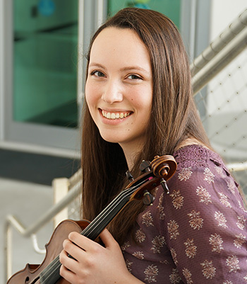

<!DOCTYPE html>

<html>

<head>
  <meta charset="utf-8">
  <title>Resume</title>
</head>

<body>
<header>
<h1>Claire Geho</h1>
<!--I would like to center this contact information and remove the bullets once we stylize this with CSS-->
<ul>
<li>2922 Mather's Way</li>
<li>Twinsburg, Ohio 44087</li>
<li>Dual Citizenship USA and Canada</li>
<li>cmg285@miami.edu</li>
<li>440-591-9339</li>
</ul>

   Photo Credit: M. Laipang
 <!--break is included in order to display photo credit under the photo-->
</header>

<main>

<section>
<h2>Education</h2>
<h3>University of Miami, Frost School of Music</h3>
<ul>
  <li>Major: Bachelor of Instrumental Performance (Violin)</li>
  <li>Minors: Communication, Music Business and Entertainment Industries</li>
  <li>President's Scholarship Recipient</li>
  <li>President's and Provost's Honor Rolls and Dean's List</li>
  <li>3.969 GPA</li>
</ul>
</section>
<section>
<h2>Work Experience</h2>
<!--I included breaks in this section in order to distinguish the location of the places I worked.-->
<h4>Substitute Violinist</h4>
  <ul>
  <li>New World Symphony</li>
  <li>The Florida Orchestra</li>
  </ul>
<h4>Visual Designer
   The Miami Hurricane Newspaper, University of Miami</h4>
  <ul>
  <li>Create visuals and place articles for the weekly student newspaper</li>
  <li>Collaborate with editors to cut and edit works to fit the designs before deadlines</li>
  <li>Create high quality and informative news representing the student body</li>
  </ul>
<h4>Certified Red Cross Lifeguard
   Solon Community Center, Solon, Ohio></h4>
  <ul>
  <li>Manage the pool with team members and assist patrons</li>
  <li>Enforce rules and safety regulations within the facility</li>
  <li>Provide emergency care and first aid</li>
  <li>Maintain facilities and equipment</li>
  </ul>
<h4>Volunteer
   The Gathering Place, Cleveland, Ohio</h4>
  
a non-profit support center for cancer patients and their families

  <ul>
  <li>Make crafts with and encourage families</li>
  <li>Assist with organization activities including cleaning facilities, arts and crafts, and child
sitting</li>
  </ul>
</section>
<section>
<h2>Skills</h2>
<ul>
  <li>Excellent communication skills</li>
  <li>For-profit and volunteer violin performance activities</li>
  <li>Web and graphic design experience (Adobe Photoshop, InDesign, Illustrator)</li>
  <li>Photography experience</li>
</ul>
</section>
<section>
<h2>Activities and Honors</h2>
<ul>
  <li>Frost School of Music Concerto Competition Winner</li>
  <li>National Repertory Orchestra- Section Violin</li>
  <li>National Youth Orchestra of Canada- Section Violin</li>
  <li>The Castleman Quartet Program- Participant</li>
  <li>National Youth Orchestra of the United States of America- Section Violin</li>
</ul>
</section>
<section>
<h2>Media and Press</h2>
<ul>
  <li><a href="https://southfloridaclassicalreview.com/2020/02/schwarz-frost-symphony-bring-heroic-swagger-to-heldenleben/">South Florida Classical Review</a></li>
  <li><a href="https://www.mytownneo.com/entertainment/20160422/video-two-youth-instrumentalists-chosen-to-participate-in-national-orchestra-this-summer">NYO-USA Preview</a></li>
  <li><a href="https://www.youtube.com/watch?v=W3a74K3KCCg">NYO-USA Preview Video</a></li>
</ul>
</section>

</main>

<footer>

Claire Geho, 2020

</footer>
</body>
</html>
